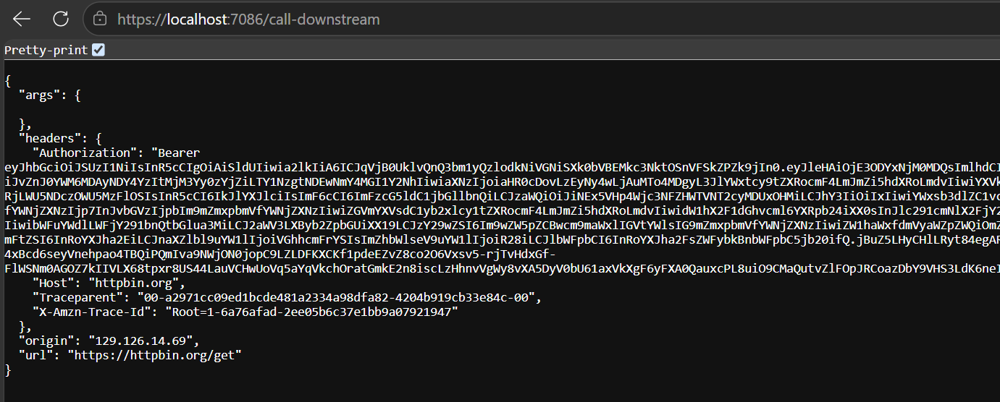
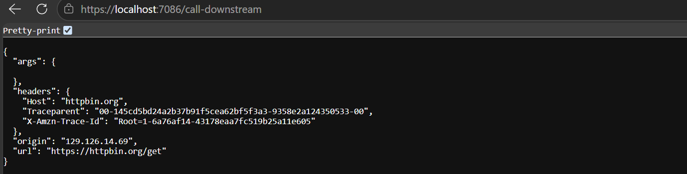

# Methrax.Bff.AspNetCore

A lightweight, opinionated Backend-for-Frontend (BFF) security library for ASP.NET Core that simplifies SPA authentication:

Cookie-Based Browser Boundary: Uses HttpOnly, SameSite cookies to insulate client-side applications (Angular, React) from raw OAuth2/OIDC tokens.

Server-Side Token Storage: Securely manages access, refresh, and ID tokens on the server for downstream microservice delegation.

Turnkey OIDC Integration: Connects seamlessly with Identity Providers like Keycloak using production-hardened defaults out of the box.

---

## ✨ Key Features

| Feature | Category | Description |
|---|---|---|
| **Modern .NET Target** | Core Runtime | Built natively for **.NET 10** with optimized Minimal API support. |
| **BFF Security Model** | Architecture | Cookie-based session boundary that keeps raw JWT tokens strictly server-side. |
| **OIDC Integration** | Authentication | Seamless OpenID Connect integration for Keycloak and generic Identity Providers. |
| **Server-Side Ticket Store** | Session Management | Offloads large encrypted session tickets and tokens off cookies using `ITicketStore` (Memory, Redis, DB). |
| **Token Lifecycle & Persistence** | Delegation | Optional token persistence (`SaveTokens`) supporting downstream API delegation and refresh token flows. |
| **Hardened Production Defaults** | Security | Out-of-the-box `HttpOnly`, `SameSite = Lax`, and `SecurePolicy = Always` enforcement. |
| **Explicit Configuration** | Developer Experience | Centralized `Methrax:BffAuthentication` setup via `appsettings.json` with eager startup validation. |

---

### 🛡️ Security & Architecture
- **Zero-Token Browser Footprint:** Protects SPAs (e.g., Angular) against XSS token theft by using secure HTTP-only cookies.
- **CSRF & Transport Defense:** Enforces strict SameSite cookie behavior and mandates HTTPS execution across all environments.
- **Pluggable Session Storage:** Flexible ticket store providers prevent cookie bloat and support distributed multi-instance scale-out.

### ⚙️ Developer Experience & Tooling
- **Minimal Setup API:** Single-line registration via `AddBffAuthentication()` with smart default fallbacks.
- **Customizable Endpoints:** Configurable route paths for `/login`, `/logout`, `/user`, and `/token-info`.
- **Production-Ready Samples:** Repository includes complete reference implementations, migration guides, and upgrade notes.

---

## 📝 Release Notes

### v1.1.0 (releases/v1.1.0)

This repository is an open source library distributed under the MIT License. The v1.1.0 release focuses on security hardening, configuration improvements, and documentation updates. For the full detailed diff, see the GitHub release or tag for v1.1.0.

Highlights

- Improved default security posture for cookies and OIDC configuration.
- Made BFF configuration more explicit and easier to customize from appsettings.json.
- Improved sample projects and documentation to show recommended production settings.
 - Added server-side ticket store support for persisting authentication tickets and tokens (configurable providers).
 - Optional token storage for refresh tokens with pluggable store providers (in-memory, distributed cache, database).

Breaking changes (important upgrade notes)

- The project now targets .NET 10. Ensure your application is upgraded to .NET 10 before updating the NuGet package.
- Cookie SameSite default behavior has been tightened to `Lax` to reduce CSRF risk. If your deployment relied on cross-site requests, explicitly set `BffAuthentication:Cookie:SameSite` to `None` and configure CORS accordingly.
- Configuration defaults may have changed; verify the `Methrax:BffAuthentication` section in your appsettings.json against the configuration reference below.

### v1.0.2 (`releases/v1.0.2`)

The **v1.0.2** release was a patch release focused on bug fixes, token forwarding reliability, and pipeline stabilization for ASP.NET Core hosts.

| Category | Summary |
|---|---|
| **Target Framework** | .NET 9 / .NET 8 LTS |
| **Focus** | Bug fixes, OIDC challenge redirect handling, and HTTP context token accessor fixes. |

#### 🌟 Highlights
- **Token Forwarding Handler Fixes:** Resolved an issue where `TokenForwardingHandler` failed to retrieve valid tokens from `HttpContext` during high-concurrency requests.
- **RP-Initiated Sign-Out Alignment:** Fixed state handling during `/logout` OIDC redirect parameter construction to guarantee proper single sign-out (SLO) with Keycloak and generic IdPs.
- **Minimal API Integration:** Refined route handler response types for `/user` and `/token-info` endpoints to return standard HTTP status payloads (`401 Unauthorized`, `200 OK`).
- **Documentation Updates:** Expanded initial sample project documentation for Angular and ASP.NET Core integration.

#### 🛠️ Maintenance & Patch Changes
- Fixed null reference exceptions in OIDC options validation when `ClientSecret` was omitted in public client configurations.
- Ensured `SaveTokens` correctly persisted ISO-8601 UTC timestamp values for `expires_at`.

#### Migration steps

1. Upgrade your application to .NET 10.
2. Review your `BffAuthentication` section in appsettings.json and explicitly set any cookie or endpoint values you rely on.
3. If you depend on cross-site cookie behavior, set:

```json
"Methrax": {
    "BffAuthentication": {
      "Cookie": {
        "SameSite": "None",
        "SecurePolicy": "Always",
        "HttpOnly": true
      }
    }
}
```

4. Run integration tests for authentication flows (login, logout, access-denied) and adjust CORS if necessary.

If you depend on a specific behavioral detail that changed in v1.1.0, consult the v1.1.0 release notes on the project GitHub page for the definitive list.

---

## 🚀 Installation

```bash
dotnet add package Methrax.Bff.AspNetCore

```

## 🧩 Enable BFF Middleware

To enable Backend-for-Frontend (BFF) authentication in your application, register the BFF authentication services in `Program.cs`.

This sets up cookie authentication and OpenID Connect handling required for secure BFF flows.

```csharp
// Add BFF Middleware to handle authentication and authorization flows in a BFF architecture.
builder.Services.AddBffAuthentication();
```
---
## ⚙️ Configuration Reference

All settings are defined under the Methrax:BffAuthentication section in appsettings.json.

[!IMPORTANT]
Breaking Change in v1.1.0: The root configuration section name was changed from `BffAuthentication` to `Methrax:BffAuthentication`. Ensure your appsettings.json is updated accordingly.

If a value is not provided, default values are applied where applicable. Configuration options are automatically validated at application startup using BackendForFrontendOptionsValidator

---

### 🔹 Root Configuration

| Property | Type | Required | Default Value | Description |
|---|---|---|---|---|
| Authority | `string` | ✅ | `""` | OpenID Connect authority URL (Identity Provider). Must be a valid absolute URL. |
| ClientId | `string` | ✅ | `""` | OAuth2 / OIDC client identifier. |
| ClientSecret | `string` | ✅ | `""` | OAuth2 client secret. |
| RequireHttpsMetadata | `bool` | ❌ | `true` | Enforces HTTPS metadata validation for OIDC authority. |
| SaveTokens | `bool` | ❌ | `true` | Persists OAuth2/OIDC tokens in the authentication properties/cookie. |
| EnableServerSideSessions | `bool` | ❌ | `false` | Enables server-side session management via `ITicketStore` integration. |
| Scopes | `string[]` | ❌ | `["openid", "profile", "offline_access"]` | Requested OIDC scopes. |
| Cookie | `object` | ❌ | See Cookie table below | Cookie authentication configuration. |
| Endpoints | `object` | ❌ | See Endpoint table below | Authentication endpoints for login, logout, and access denied. |
| Tokens | `object` | ❌ | See Tokens table below | Custom key mappings for storing tokens in authentication properties. |

---

### 🔹 Scopes Default Behavior

If `Scopes` is omitted, the following default scopes are requested:

| Scope | Type | Purpose |
|---|---|---|
| `openid` | Standard OIDC | Required to issue an ID Token and authenticate the user. |
| `profile` | Standard OIDC | Requests standard profile claims (e.g., name, preferred username). |
| `offline_access` | OAuth2 Extension | Requests a Refresh Token for background token renewal. |

### 🔹 Cookie Configuration

| Property     | Type                         | Required | Default Value | Description                                                  |
|--------------|------------------------------|----------|---------------|--------------------------------------------------------------|
| SameSite     | `SameSiteMode`              | ❌        | `Lax`         | Controls cookie cross-site behavior                          |
| SecurePolicy | `CookieSecurePolicy`        | ❌        | `Always`      | Defines when the cookie should only be sent over HTTPS       |
| HttpOnly     | `bool`                      | ❌        | `true`        | Prevents JavaScript access to the authentication cookie      |

### 🔹 Endpoint Configuration

*Note: All paths must start with a leading slash `/`.*

| Property | Type | Required | Default Value | Description |
|---|---|---|---|---|
| LoginPath | `string` | ❌ | `/login` | Endpoint used to trigger the OIDC login flow. |
| LogoutPath | `string` | ❌ | `/logout` | Endpoint used to sign out the user and terminate the session. |
| AccessDeniedPath | `string` | ❌ | `/access-denied` | Redirect path when user access is denied. |

### 🔹 Token Key Configuration (`Tokens`)

Customizes the property key names used to store token values within `AuthenticationProperties`.

| Property | Type | Required | Default Value | Description |
|---|---|---|---|---|
| AccessToken | `string` | ❌ | `access_token` | Key name for storing/retrieving the OAuth2 access token. |
| RefreshToken | `string` | ❌ | `refresh_token` | Key name for storing/retrieving the OAuth2 refresh token. |
| IdToken | `string` | ❌ | `id_token` | Key name for storing/retrieving the OpenID Connect ID token. |
| ExpiresAt | `string` | ❌ | `expires_at` | Key name for storing the token expiration ISO-8601 UTC timestamp. |

---

### 🔹 Full `appsettings.json` Overview

| Section | Key | Example Value | Notes |
|---|---|---|---|
| `Methrax:BffAuthentication` | `Authority` | `"https://demo.authority.com"` | IDP Authority Base URL |
| `Methrax:BffAuthentication` | `ClientId` | `"interactive.confidential"` | Client application identifier |
| `Methrax:BffAuthentication` | `ClientSecret` | `"secret"` | Client secret key |
| `Methrax:BffAuthentication` | `RequireHttpsMetadata` | `true` | Set `false` only in local dev |
| `Methrax:BffAuthentication` | `SaveTokens` | `true` | Saves tokens in authentication ticket |
| `Methrax:BffAuthentication` | `EnableServerSideSessions` | `false` | Set `true` if `ITicketStore` registered |
| `Methrax:BffAuthentication:Cookie` | `SameSite` | `"Lax"` | Cookie SameSite policy |
| `Methrax:BffAuthentication:Cookie` | `SecurePolicy` | `"Always"` | Force Secure flag on cookies |
| `Methrax:BffAuthentication:Cookie` | `HttpOnly` | `true` | Protect from XSS |
| `Methrax:BffAuthentication:Endpoints` | `LoginPath` | `"/login"` | Trigger login challenge endpoint |
| `Methrax:BffAuthentication:Endpoints` | `LogoutPath` | `"/logout"` | Trigger sign-out endpoint |
| `Methrax:BffAuthentication:Endpoints` | `AccessDeniedPath` | `"/access-denied"` | Forbidden access redirect endpoint |
| `Methrax:BffAuthentication:Tokens` | `AccessToken` | `"access_token"` | Custom access token property key |
| `Methrax:BffAuthentication:Tokens` | `RefreshToken` | `"refresh_token"` | Custom refresh token property key |
| `Methrax:BffAuthentication:Tokens` | `IdToken` | `"id_token"` | Custom ID token property key |
| `Methrax:BffAuthentication:Tokens` | `ExpiresAt` | `"expires_at"` | Custom expiration property key |

### Example `appsettings.json`

```json
{
  "Methrax": {
    "BffAuthentication": {
      "Authority": "[https://demo.authority.com](https://demo.authority.com)",
      "ClientId": "interactive.confidential",
      "ClientSecret": "secret",
      "RequireHttpsMetadata": true,
      "SaveTokens": true,
      "EnableServerSideSessions": false,

      "Scopes": [
        "openid",
        "profile",
        "offline_access",
        "api"
      ],

      "Cookie": {
        "SameSite": "Lax",
        "SecurePolicy": "Always",
        "HttpOnly": true
      },

      "Endpoints": {
        "LoginPath": "/login",
        "LogoutPath": "/logout",
        "AccessDeniedPath": "/access-denied"
      },

      "Tokens": {
        "AccessToken": "access_token",
        "RefreshToken": "refresh_token",
        "IdToken": "id_token",
        "ExpiresAt": "expires_at"
      }
    }
  }
}
```

## 🚀 Step-by-Step Guide: Configuring `Methrax.Bff.AspNetCore`

This guide walks you through setting up `Methrax.Bff.AspNetCore` in an ASP.NET Core application, covering both **With Token Persistence** (for API delegation) and **Without Token Persistence** (for pure session-only authentication).

---

### Step 1: Install Package & Define Configuration

Add your OpenID Connect (Keycloak / IdP) details to `appsettings.json` under the `Methrax:BffAuthentication` root section.

```json
{
  "Methrax": {
    "BffAuthentication": {
      "Authority": "[https://identity-provider.example.com/realms/master](https://identity-provider.example.com/realms/master)",
      "ClientId": "bff-client-app",
      "ClientSecret": "your-client-secret",
      "RequireHttpsMetadata": true,
      
      "Cookie": {
        "SameSite": "Lax",
        "SecurePolicy": "Always",
        "HttpOnly": true
      },

      "Endpoints": {
        "LoginPath": "/login",
        "LogoutPath": "/logout",
        "AccessDeniedPath": "/access-denied"
      }
    }
  }
}
```

### Step 2: Choose Your Token Persistence Strategy

Depending on whether your BFF needs to call downstream APIs on behalf of the user, choose **Scenario A** or **Scenario B**.

#### 💡 Understanding `SaveTokens` & `EnableServerSideSessions`

| Setting | `SaveTokens = true` | `SaveTokens = false` |
|---|---|---|
| **Token Storage** | Tokens (`access_token`, `refresh_token`, `id_token`) are saved in the authentication properties/session ticket. | Tokens are discarded after sign-in; only claims/user identity are kept in the session. |
| **Memory Footprint** | Slightly larger session ticket size. | Minimal session ticket size. |
| **Downstream Delegation** | ✅ Required if YARP or `TokenForwardingHandler` needs to pass Bearer tokens to backend microservices. | ❌ Cannot call downstream APIs requiring user Bearer tokens. |
| **Use Case** | Full BFF Gateway acting as an API proxy/delegator. | Pure Session Gateway used solely for user authentication and UI claims lookup. |

---

#### 📍 Scenario Comparison Summary

| Feature / Capability | Scenario A: With Token Persistence | Scenario B: Without Token Persistence |
|---|---|---|
| **Primary Option** | `SaveTokens = true` | `SaveTokens = false` |
| **Session Mode** | `EnableServerSideSessions = true` (`ITicketStore`) | `EnableServerSideSessions = false` |
| **Session Artifacts** | User Claims + Encrypted Tokens | User Claims Only |
| **Supported Outbound Calls** | YARP Reverse Proxy & `HttpClient` Delegation | None (Inbound Auth Only) |
| **Target Architecture** | Microservices Architecture | Single Monolith / Standalone SPA Shell |

---

#### 📍 Scenario A: WITH Token Persistence (`SaveTokens = true`) — *Recommended for Microservices*

Use this scenario when your BFF proxies requests or programmatically calls downstream microservices using the user's `access_token`.

```csharp
using Methrax.Bff.AspNetCore;
using Microsoft.AspNetCore.Authentication.Cookies;

var builder = WebApplication.CreateBuilder(args);

// 1. Enable Server-Side Sessions to prevent large cookies
builder.Services.AddMemoryCache();
builder.Services.AddSingleton<ITicketStore, MemoryCacheTicketStore>();

// 2. Configure BFF with SaveTokens enabled
builder.Services.AddBffAuthentication(options =>
{
    // Persist tokens inside server-side session for API delegation
    options.SaveTokens = true;
    
    // Store tickets in ITicketStore rather than sending large encrypted cookies to the browser
    options.EnableServerSideSessions = true;
});

// 3. Register TokenForwardingHandler for HttpClient calls
builder.Services.AddHttpContextAccessor();
builder.Services.AddTransient<TokenForwardingHandler>();

builder.Services.AddHttpClient("downstream-api", client =>
{
    client.BaseAddress = new Uri("[https://api.internal.example.com/](https://api.internal.example.com/)");
})
.AddHttpMessageHandler<TokenForwardingHandler>();

var app = builder.Build();

app.UseAuthentication();
app.UseAuthorization();

// Downstream call succeeds because access_token is persisted
app.MapGet("/api/data", async (IHttpClientFactory httpClientFactory) =>
{
    var client = httpClientFactory.CreateClient("downstream-api");
    var response = await client.GetAsync("protected-resource");
    return Results.Content(await response.Content.ReadAsStringAsync(), "application/json");
}).RequireAuthorization();

app.Run();
```



#### 📍 Scenario B: WITHOUT Token Persistence (`SaveTokens = false`) — *Lightweight Session Only*

Use this scenario when the BFF only manages user login/logout and session state for the frontend shell, and does not need to forward Bearer tokens to external APIs.

| Feature / Setting | Value / Behavior |
|---|---|
| **`SaveTokens`** | `false` |
| **`EnableServerSideSessions`** | `false` |
| **Session Artifacts** | User claims only (tokens discarded post-authentication) |
| **Outbound Bearer Tokens** | Disabled / Unavailable |
| **Use Case** | Standalone SPA Shell, Monoliths, or APIs with self-contained session cookies |

```csharp
using Methrax.Bff.AspNetCore;

var builder = WebApplication.CreateBuilder(args);

// Configure BFF with SaveTokens disabled
builder.Services.AddBffAuthentication(options =>
{
    // Tokens are NOT saved in session properties
    options.SaveTokens = false;
    options.EnableServerSideSessions = false;
});

var app = builder.Build();

app.UseAuthentication();
app.UseAuthorization();

// Endpoint returns profile claims, but no raw access tokens are stored on the server
app.MapGet("/user", (HttpContext context) =>
{
    if (context.User.Identity?.IsAuthenticated != true)
        return Results.Unauthorized();

    var claims = context.User.Claims.Select(c => new { c.Type, c.Value });
    return Results.Ok(claims);
});

app.Run();
````


---
## 🧪 Angular + .NET Sample Project

This repository includes a working sample under the `/Samples` directory:

- ASP.NET Core BFF Server → `Samples/Bff.Server`
- Angular Client → `Samples/Angular.Client`

---

### 🧠 What this sample demonstrates

* **ASP.NET Core BFF Host:** Configured with `AddBffAuthentication()` for eager startup option validation and automated authentication pipeline setup.
* **Identity Provider Integration:** OpenID Connect (OIDC) authentication supporting providers like Keycloak with `SaveTokens` enabled.
* **Server-Side Session Storage:** Integrated with `ITicketStore` and `MemoryCacheTicketStore` (`EnableServerSideSessions = true`) to keep tokens secure on the server.
* **YARP Reverse Proxy:** Intercepts and proxies requests via `MapReverseProxy()` to downstream microservices.
* **Delegating Token Forwarding:** Uses `TokenForwardingHandler` with a named `HttpClient` to automatically attach Bearer access tokens to downstream API calls (`/call-downstream`).
* **BFF Endpoint Suite:** Built-in minimal APIs for OIDC challenge (`/login`), RP-initiated sign-out (`/logout`), authenticated profile lookup (`/user`), and session token diagnostics (`/token-info`).
* **SPA Integration:** Protects single-page applications (like Angular) by using encrypted, SameSite HTTP-only cookies instead of exposing tokens to the browser.

---

### 🏗 Architecture


```text
               ┌────────────────────────┐
               │      Angular SPA       │
               │ (Browser Client App)   │
               └───────────┬────────────┘
                           │
             SameSite HTTP-Only Session Cookie
                           │
                           ▼
 ┌─────────────────────────────────────────────────────┐
 │                  ASP.NET Core BFF                   │
 │           (Methrax.Bff.AspNetCore Host)             │
 │                                                     │
 │ ┌───────────────────┐     ┌───────────────────────┐ │
 │ │  Endpoints        │     │ Server-Side Sessions  │ │
 │ │ /login, /logout,  │     │ ITicketStore          │ │
 │ │ /user, /token-info│     │ (MemoryCache)         │ │
 │ └───────────────────┘     └───────────────────────┘ │
 │ ┌───────────────────┐     ┌───────────────────────┐ │
 │ │  YARP Proxy       │     │ TokenForwardingHandler│ │
 │ │  MapReverseProxy  │     │ HttpClient            │ │
 │ └─────────┬─────────┘     └───────────┬───────────┘ │
 └───────────┼───────────────────────────┼─────────────┘
             │                           │
  Proxied API Requests         Bearer Token Delegation
             │                           │
             ▼                           ▼
 ┌──────────────────────┐    ┌───────────────────────┐
 │ Downstream Services  │    │ Downstream Microservices│
 └──────────────────────┘    └───────────────────────┘
             │
             │ OIDC Authentication / Token Exchange
             ▼
 ┌───────────────────────────────────────────────────┐
 │       OpenID Connect Provider (e.g. Keycloak)     │
 └───────────────────────────────────────────────────┘
```


## 📖 Deep Dive (Architecture & Security Model)

This library is based on a detailed exploration of modern authentication evolution and BFF architecture.

👉 **Full article:**  
[Beyond PKCE: Building Secure Backend-for-Frontend (BFF) Authentication with Angular, .NET & Keycloak](https://tharaka-madhusanka.medium.com/beyond-pkce-building-secure-backend-for-frontend-bff-authentication-with-angular-net-ff29d5a42a49)
---

### 🧠 What the Article Covers

This library is the practical implementation of the concepts explained in the article below:

---

### 1. Evolution of Modern Authentication
- OAuth 2.0 fundamentals
- PKCE ("Pixie") flow
- OAuth 2.1 improvements and security tightening

---

### 2. What is PKCE Authentication?
- How public clients (SPA/mobile) authenticate securely
- How code challenge & verifier work
- Why PKCE became the default for SPAs

---

### 3. Why PKCE Alone Is Not Fully Secure
- Token storage risks in browsers
- XSS-based token theft
- Refresh token exposure issues
- Limitations of client-side OAuth

---

### 4. What is Backend-for-Frontend (BFF)?
- Moving authentication from browser → server
- Using secure cookies instead of tokens
- Server-controlled session management
- Eliminating token exposure in frontend apps

---

### 5. Key Requirements for a Secure BFF Implementation

#### 5.1 Cookie & Session Security Strategy
- **CSRF & XSS Mitigation:** Mitigate cross-site request forgery by enforcing strict `SameSite` policies and marking session cookies as `HttpOnly` to prevent JavaScript token access.
- **Secure Cookie Transmission:** Mandate `CookieSecurePolicy.Always` to guarantee session cookies are transmitted strictly over encrypted HTTPS connections.
- **Server-Side Session Persistence (`EnableServerSideSessions`):** Store authentication tickets and token metadata off-cookie via `ITicketStore` (e.g., `MemoryCacheTicketStore` or Redis) to keep client cookies small and reduce attack surfaces.

#### 5.2 Token Storage & Delegation Configuration (`SaveTokens` & `Tokens`)
- **Token Lifecycle Persistence (`SaveTokens`):** Persist OAuth2/OIDC access, refresh, and ID tokens inside server-side `AuthenticationProperties` for downstream API delegation and background renewal.
- **Custom Token Key Mapping (`Tokens`):** Configure explicit property keys (`AccessToken`, `RefreshToken`, `IdToken`, `ExpiresAt`) to map token metadata seamlessly to internal security context schemas.
- **Eager Startup Validation (`ValidateOnStart`):** Enforce `BackendForFrontendOptionsValidator` at boot to validate Authority URLs, endpoint paths, and required token keys before accepting traffic.

#### 5.3 Production BFF Configuration Defaults
- **Secure Default Settings:** Enable `RequireHttpsMetadata`, `HttpOnly = true`, and `SecurePolicy = Always` out of the box.
- **OIDC Flow Configuration:** Standardize Authorization Code Flow with PKCE, requesting core `openid`, `profile`, and `offline_access` scopes.
- **Namespace-Isolated Configuration:** Enforce section name mapping under `Methrax:BffAuthentication` for clean `appsettings.json` structure.

---

### 6. Implementing BFF Authentication

| Pattern / Component | Architectural Transition | Implementation Details |
|---|---|---|
| **Architecture Model** | Cross-Domain SPA Auth --> Same-Domain BFF Model | Replaces client-side token handling with a secure, single-origin host boundary. |
| **Session & Storage** | Public Client Tokens --> `HttpOnly` SameSite Cookie | Eliminates token exposure in browser memory and local storage to prevent XSS attacks. |
| **Backend Implementation** | Custom Auth Pipelines --> `Methrax.Bff.AspNetCore` | Configures ASP.NET Core minimal APIs (`/login`, `/logout`, `/user`) with eager startup validation. |
| **Frontend Integration** | Client-side OAuth/OIDC --> Zero-Token Angular Shell | Angular app relies entirely on browser cookies without storing or handling raw JWT tokens. |

---

#### 6.1 Transitioning from Cross-Domain SPA Auth
* **The Problem:** Traditional SPAs handle OAuth2 flows directly in browser JavaScript, storing access and refresh tokens in `localStorage` or memory, leaving them vulnerable to XSS token theft.
* **The Solution:** Migrate to a same-domain BFF architecture where authentication and token storage are handled strictly on the server.

#### 6.2 The Same-Domain Secure BFF Model
* **Cookie-Based Boundary:** All requests between the Angular SPA and the ASP.NET Core BFF use same-domain, `HttpOnly`, `SameSite = Lax` (or `Strict`), and `Secure` cookies.
* **Token Abstraction:** Browser client application never receives or sees the raw `access_token`, `refresh_token`, or `id_token`.

#### 6.3 ASP.NET Core Implementation Patterns
* Leverage `Methrax.Bff.AspNetCore` extension methods (`AddBffAuthentication()`) to configure OIDC authentication and server-side session persistence.
* Enable `ITicketStore` (e.g., `MemoryCacheTicketStore` or Redis) to store authentication tickets on the server and keep browser cookie payloads minimal.
* Use YARP reverse proxy transforms or `TokenForwardingHandler` to automatically attach Bearer access tokens to outbound microservice calls.

#### 6.4 Angular Integration (Zero-Token Handling)
* **Simplified Client Code:** Remove client-side OAuth libraries (such as `angular-oauth2-oidc`).
* **Session Interceptor:** Attach `{ withCredentials: true }` to Angular `HttpClient` requests to ensure session cookies are sent across origin requests.
* **Auth Guard Strategy:** Route protection relies on invoking the `/user` BFF endpoint to check current session validity rather than decoding client-side JWT claims.

---

## 🔗 Relationship to This Library

This NuGet package is the **production-ready implementation** of the architecture described above:

- 📘 Article = Theory & Security model
- 📦 Library = Practical implementation
- 🧪 Sample project = Real-world usage

---

## 📜 License

> © 2026 Tharaka Madhusanka - Methrax  
> This project is open source and free to use under the MIT License.